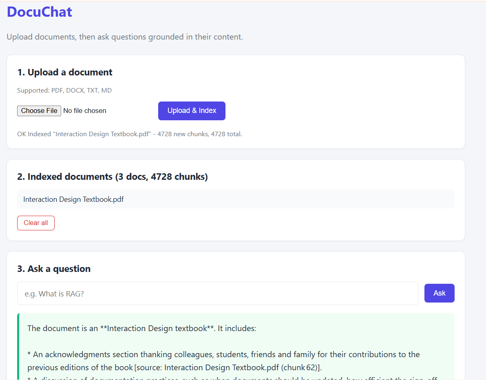

# DocuChat — Chat with Your Documents (RAG)


A **retrieval-augmented generation (RAG)** web application that lets you
upload documents (PDF, DOCX, TXT, MD) and chat with them — with
**grounded answers and inline citations**.

Built with a **local-first architecture**: parsing, chunking, embedding,
and retrieval all run on-device. Only the final LLM generation step calls
a cloud API (Groq's GPT-OSS-120B, free tier).

---

## Why RAG?

Large language models hallucinate when asked about private or recent
information. RAG fixes this by:

1. **Retrieving** relevant passages from your documents
2. **Grounding** the LLM's answer in those passages
3. **Citing** the source of every claim

DocuChat demonstrates this pipeline end-to-end.

---

## Architecture
LOCAL (your machine) CLOUD
┌────────────────────────────────────────────┐ ┌──────────────────┐
│ │ │ │
│ Upload PDF/DOCX/TXT/MD │ │ Groq │
│ ↓ │ │ GPT-OSS-120B │
│ Text extraction (pypdf / python-docx) │ │ (free tier) │
│ ↓ │ │ │
│ Chunking (500 chars, 50 overlap) │ │ │
│ ↓ │ │ │
│ Embedding (all-MiniLM-L6-v2, 384-d) │ │ │
│ ↓ │ │ │
│ ChromaDB (persistent vector store) │ │ │
│ │ │ │
│ User question │ │ │
│ ↓ │ │ │
│ Semantic search → top-k chunks ──────────►│────►│ Prompt + context│
│ │ │ ↓ │
│ │◄────│ Grounded answer │
│ Display answer + source citations │ │ │
└────────────────────────────────────────────┘ └──────────────────┘


**Result:** sub-2-second answers, minimal local RAM, and fully grounded
responses with citations.

---

## Features

- 📄 **Multi-format ingestion** — PDF, DOCX, TXT, Markdown
- 🔍 **Semantic search** — cosine similarity over 384-dim embeddings
- 🤖 **Grounded LLM answers** — refuses to answer if the context doesn't support it
- 📎 **Inline citations** — every answer cites its source chunks
- 🎨 **Clean web UI** — upload, index, chat, reset
- 🔒 **Privacy-conscious** — documents stay on your machine until the final LLM call
- 💾 **Persistent vector store** — ChromaDB survives restarts

---

## Demo



*Upload documents, ask questions, get cited answers.*

---

## Tech Stack

| Layer | Tool |
|-------|------|
| **Web framework** | Django 6.1 |
| **Vector DB** | ChromaDB 1.5 (persistent, local) |
| **Embeddings** | `sentence-transformers/all-MiniLM-L6-v2` (384-d) |
| **LLM (cloud)** | Groq `openai/gpt-oss-120b` (free tier) |
| **LLM (local fallback)** | Ollama (Llama 3.2, Phi-3) |
| **PDF parsing** | pypdf |
| **DOCX parsing** | python-docx |
| **Frontend** | Vanilla JS + fetch (no framework) |

---

## Setup

## Setup

### 1. Clone & install

```powershell
git clone https://github.com/mxolisi78/DocuChat.git
cd DocuChat
python -m venv venv
.\venv\Scripts\Activate.ps1
pip install -r requirements.txt
```

### 2. Get a Groq API key (free)

1. Sign up at https://console.groq.com
2. Go to **API Keys** → **Create API Key**
3. Copy the `gsk_...` key

### 3. Configure environment

> 💡 Tip: copy `.env.example` to `.env` and fill in your values.

```powershell
copy .env.example .env
```

Then open `.env` and set your key:

```env
LLM_PROVIDER=groq
GROQ_API_KEY=gsk_your_key_here
LLM_MODEL=openai/gpt-oss-120b

EMBED_MODEL=sentence-transformers/all-MiniLM-L6-v2
CHUNK_SIZE=500
CHUNK_OVERLAP=50
TOP_K=4

UPLOAD_DIR=data/uploads
CHROMA_DIR=data/chroma_db
```

⚠️ **Never commit the real `.env` file.** It contains your API key.

### 4. Run

```powershell
python manage.py migrate
python manage.py runserver
```

Open **http://127.0.0.1:8000/** in your browser.

Usage
Upload a PDF, DOCX, TXT, or MD file → wait for the "✓ Indexed" message

Ask a question in natural language

Read the grounded answer with inline [source: filename] citations

Click Clear all to reset the vector store

Project Structure
text
DocuChat/
├── chat/                      # Django app
│   ├── views.py               # upload / ask / reset views
│   ├── urls.py
│   └── templates/chat/
│       ├── base.html
│       └── home.html
├── docuchat_web/              # Django project config
├── src/                       # RAG core (framework-agnostic)
│   ├── config.py              # reads .env
│   ├── ingest.py              # load + chunk
│   ├── embed_store.py         # embed + ChromaDB
│   ├── retrieve.py            # semantic search
│   └── rag.py                 # LLM prompt + generation
├── data/
│   ├── uploads/               # user-uploaded files
│   └── chroma_db/             # persistent vector store
├── notebooks/                 # exploration
├── scripts/                   # local test scripts
├── requirements.txt
├── manage.py
└── README.md
Design Decisions
Why local embeddings + cloud LLM?
The RAG pipeline has two heavy components:

Embeddings — small (80 MB model), fast on CPU, private

Generation — requires a large LLM; local inference needs 8+ GB RAM

Running embeddings locally and generation in the cloud gives the best
tradeoff: document privacy for retrieval, free high-quality LLM output,
fast responses, minimal RAM.

The app also supports fully offline operation via Ollama — set
LLM_PROVIDER=ollama in .env (requires 16+ GB RAM for good performance).

Why ChromaDB?
Embedded, no server process needed

Persistent on disk (survives restarts)

Supports cosine similarity natively

Simple Python API

Why 500-char chunks with 50-char overlap?
Too small → lose context, worse retrieval

Too large → dilute relevance, waste tokens

500 chars ≈ 1-2 paragraphs — enough context, still focused

50-char overlap prevents cutting sentences in half

Limitations
Scanned PDFs (image-only) are not OCR'd — pypdf extracts text, not images. Add pytesseract + pdf2image for OCR.

Single-user, single-collection — no auth or multi-tenant support. All users see the same documents.

No streaming — the LLM answer is returned all at once.

Vector store is unencrypted — anyone with disk access can inspect it.

What I Learned
RAG grounds answers. The model literally refuses to answer
questions not supported by context — proving the value of retrieval.

Chunking is an art. Splitting at paragraph boundaries with overlap
dramatically improves retrieval quality over naive fixed-size splits.

Local + cloud is a real architecture. Not every part of ML needs to
run in the cloud, and not every part can run locally. Hybrid is the
pragmatic answer for a laptop with 8 GB RAM.

Citations build trust. Showing the exact source chunk with a
similarity score makes answers auditable.

Imbalanced hardware is real. Building for RAM-constrained machines
forces good architectural decisions.

License
MIT — see LICENSE.

## Author

**Mxolisi Maseko**
- GitHub: [@mxolisi78](https://github.com/mxolisi78)
- LinkedIn: [Mxolisi Maseko](https://www.linkedin.com/in/mxolisi-maseko-9810b93a4/)

